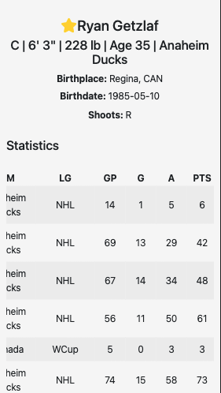
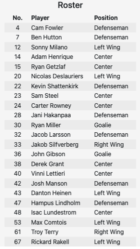

# Center Ice

Center Ice is a dynamic HTML, CSS, and JavaScript web application that allows users to view to view information on NHL teams and players

[Live Demo](https://codywiseman.github.io/ajax-project/)

## Current Features 

* User can view each NHL team as well as general team information
* User can view each NHL team's current active roster
* User can navigate to individual player pages via search or roster table on team page
* User can view player inforation and career statistics
* User can click on star next to player name to favorite/unfavorite that player
* User can view favorite players on tracked players page to view current season stats

## Planned Additions

* Users can view team standings
* User can view all awards given at the end of the season
* User can view the projected end of season stats for a player 

## What I learned from this project

* Taking the time to properly plan a project allows for quicker project execution
* Carefully and thoughtfully writing out code will make it easier to make changes later
* How to request data from an API and create a DOM tree for the data requested by the user

## Screenshots

